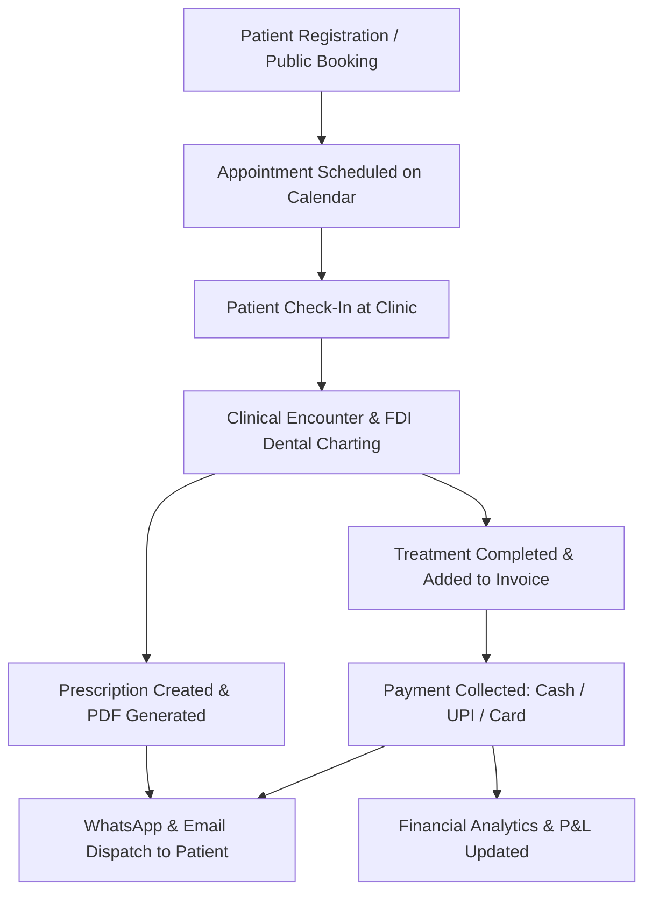

# DentaPure Project Report

---

## 1. Project Overview

### Plain-Language Summary
**DentaPure** is a modern, cloud-based dental clinic management SaaS platform designed to digitize and streamline end-to-end operations for dental practices. It addresses the operational friction of paper-based or fragmented dental management by integrating patient records, FDI dental charting, clinical encounter logging, prescription building, appointment scheduling, billing/invoicing with GST calculations, automated WhatsApp & Email messaging, and comprehensive financial analytics into a single unified workspace.

### Target Users & Interactivity
1. **Clinic Owners & Admins**:
   - Manage clinic metadata, doctor credentials, operating hours, and chair configurations.
   - Manage staff directories, assign custom Role-Based Access Control (RBAC) permissions, and monitor security sessions/audit logs.
   - Access high-level financial analytics, revenue tracking, profit & loss (P&L) statements, and expense ledgers.
   - Configure referral programs (Refer & Earn) and manage subscription licensing tiers.
2. **Dentists & Specialists**:
   - Review daily appointment schedules and assigned dental chairs.
   - Record structured clinical encounters (chief complaints, vitals, clinical notes, ICD/diagnoses).
   - Perform interactive FDI dental charting (32 adult / 20 pediatric teeth) and establish treatment plans.
   - Create digitized prescriptions, generate PDF documents, and trigger instant WhatsApp/Email delivery to patients.
3. **Front-Desk Staff & Receptionists**:
   - Register new patients and search existing patient profiles with phone-number prefix matching.
   - Schedule, reschedule, and manage appointment statuses (Pending, Confirmed, Checked In, In Progress, Completed, Cancelled, No Show).
   - Generate treatment invoices, apply line-item or total discounts, calculate GST, and record partial/full payments across multiple payment channels (Cash, UPI, Card, Net Banking, Cheque).
   - Print receipts optimized for A4 or thermal printers and dispatch digital receipts to patients.
4. **Patients**:
   - Self-book appointments online via the public booking portal (`/book`).
   - Receive automated appointment confirmations, prescriptions, and payment receipts directly on WhatsApp and Email.

### Business Model Context
DentaPure is structured as a **B2B SaaS platform** sold to dental clinics on a subscription model (Basic, Professional, Enterprise tiers). Subscriptions dictate seat limits (maximum doctors and receptionists), feature access flags (e.g., custom role permission editing, advanced analytics, audit logging), and monthly WhatsApp messaging quotas. The platform also includes a built-in B2B referral engine (Refer & Earn) to incentivize clinic-to-clinic growth.

---

## 2. How the Project Works

### End-to-End Core User Flows



1. **Patient Onboarding**: Front-desk staff registers a patient via the registration modal, or a patient self-books via `/book`. Phone number uniqueness is validated. Records are created in the `patients` Firestore collection.
2. **Appointment Scheduling**: Appointments are booked on `/admin/calendar` (Day, Week, or Month view) or through `/book`. Appointments specify doctor, date, time slot, duration, and assigned dental chair (`Chair 1-4`). Status transitions are tracked from `Pending` → `Confirmed` → `Checked In` → `In Progress` → `Completed`.
3. **Clinical Encounter & Dental Charting**: Dentists open the patient profile (`/admin/patients/[id]` or `PatientDetailsModal`). A clinical encounter session is initiated. The dentist uses the FDI Dental Chart (supporting 32 permanent teeth [11–48] and 20 primary teeth [51–85]) to mark tooth conditions and plan/log procedures.
4. **Prescription Builder & PDF Storage**: The dentist builds a prescription specifying medication dosage, frequency, duration, timing, and oral hygiene advice. The server/client generates a PDF using `jsPDF` (`lib/services/pdfServerService.ts`), stores the binary file in Firebase Storage (`clinics/{clinicId}/prescriptions/`), and saves metadata in the `prescriptions` and `documents` Firestore collections.
5. **Billing & Invoicing**: Completed treatments are imported directly into the payment dialog (`components/admin/PaymentDialog.tsx` or `/admin/billing`). Subtotal, discounts, and GST tax rates are calculated. Split/partial payments are recorded. An invoice PDF is generated, uploaded to Firebase Storage (`clinics/{clinicId}/invoices/`), and saved in the `invoices` collection.
6. **WhatsApp & Email Dispatch**: Outbound WhatsApp dispatches are processed via the Next.js API route (`/api/whatsapp/send`) using a custom Twilio client wrapper (`lib/services/whatsappService.ts`). The system validates monthly quotas in `messagingUsage`, acquires request locks (`activeWhatsAppLocks`), sends the message with the Firebase Storage media URL, and logs delivery status in `messageLogs`. Delivery callbacks are handled via `/api/whatsapp/status`. Transactional emails are dispatched via Resend (`/api/invoices/[id]/email`).
7. **Financial & Operational Reporting**: Real-time revenue dashboards (`/admin/finance/analytics` and `/admin/billing`) calculate gross revenue, collected revenue, pending balances, expenses ledger, and net profit metrics.

### Confirmed Tech Stack (from `package.json` & codebase)

| Layer | Library / Technology | Version | Purpose |
|---|---|---|---|
| **Framework** | Next.js (App Router) | `16.2.9` | Full-stack React framework, Server Components, API Route Handlers |
| **UI Library** | React & React DOM | `19.2.4` | Core view rendering library |
| **Language** | TypeScript | `^5` | Strict static typing across frontend and backend services |
| **Database & Auth** | Firebase JS SDK | `^12.15.0` | Firestore database, Firebase Authentication, Firebase Storage |
| **State Management** | Zustand | `^5.0.14` | Global state management (e.g. appointment drawer, active tab state) |
| **Data Fetching** | `@tanstack/react-query` | `^5.101.2` | Client-side query caching, refetching, and state management |
| **Styling** | Tailwind CSS | `^4` | Utility-first CSS styling using `@tailwindcss/postcss` |
| **Icons & Motion** | Lucide React / Framer Motion | `^1.18.0` / `^12.42.2` | UI icon set and smooth component animation library |
| **PDF Generation** | `jspdf` / `html2canvas` | `^4.2.1` / `^1.4.1` | Client and server-side PDF document generation |
| **WhatsApp API** | Twilio Node SDK | `^6.0.2` | Outbound WhatsApp messaging API & status webhooks |
| **Transactional Email**| Resend | `^6.17.1` | Server-side email delivery with PDF attachments |
| **Monitoring** | `@sentry/nextjs` | `^10.69.0` | Production application monitoring and error tracking |

### Architecture & Folder Structure

```
d:\facemaxdentalclinic\sanjivanidentals\
├── app/
│   ├── (main)/                      # Public marketing landing pages
│   ├── admin/                       # Guarded Admin Portal (AdminAuthGuard)
│   │   ├── calendar/                # Day, Week, Month appointment calendar
│   │   ├── patients/                # Patient directory & workspace ([id])
│   │   ├── billing/ & invoices/     # Invoicing, receipts, and A4/thermal printing
│   │   ├── finance/ & analytics/    # Expense ledger, revenue charts, P&L statements
│   │   ├── prescriptions/           # Prescription manager, edit, and print layout
│   │   ├── refer-earn/ & referrals/ # B2B clinic referral management
│   │   ├── settings/                # Clinic Info, Team, Roles, Security, Templates
│   │   └── login/                   # Authentication page
│   ├── api/                         # Next.js Route Handlers
│   │   ├── whatsapp/send & status   # WhatsApp API handler with locking & webhooks
│   │   ├── invoices/[id]/email      # Resend email handler with PDF attachment
│   │   ├── prescriptions/[id]/email # Resend email handler for prescriptions
│   │   └── pdf/invoice & prescription# Server-side PDF generation endpoints
│   └── book/                        # Patient online self-booking workflow
├── components/                      # Modular UI component directory
│   ├── admin/                       # Admin layout, sidebar, workspace tabs
│   ├── auth/                        # AdminAuthGuard route protector
│   ├── calendar/                    # Interactive Day, Week, Month calendar views
│   └── dental-chart/                # FDI dental chart SVG & treatment panels
├── lib/                             # Core business logic & services
│   ├── config/env.ts                # Centralized environment variable validation
│   ├── context/AuthContext.tsx      # Firebase Auth provider & session listener
│   ├── errors/                      # Centralized error handlers & HTTP maps
│   ├── firebase.ts                  # Firebase app initialization client
│   ├── services/                    # Domain service abstraction layer (21 services)
│   └── types.ts                     # Single source of truth for TypeScript types
├── firestore.rules                  # Security rules for Firestore collections
├── storage.rules                    # Security rules for Firebase Storage buckets
└── firestore.indexes.json           # Composite query indexes for Firestore
```

### Major Application Modules & File Mapping

1. **Authentication & Session Security**:
   - `lib/services/authService.ts`: Firebase Auth login, logout, and token handling.
   - `lib/services/sessionService.ts`: Tracks active device sessions in `securitySessions`, enforces concurrency limits, and monitors inactivity timeouts.
   - `components/auth/AdminAuthGuard.tsx`: Higher-order component protecting `/admin/*` routes.
2. **Patient Directory & Patient Workspace**:
   - `app/admin/patients/page.tsx` & `app/admin/patients/[id]/page.tsx`: Directory list and patient detail workspace.
   - `components/admin/PatientDetailsModal.tsx`: Comprehensive patient workspace modal.
   - `components/admin/patient-workspace/tabs/`: Workspace tabs including `MedicalHistoryTab.tsx`, `RecordsTab.tsx` (timeline), `DocumentsTab.tsx` (X-rays/files), and `InvoicesPaymentsTab.tsx`.
   - `lib/services/patientService.ts`: Patient CRUD, search indexing, phone duplicate check, and timeline builder.
3. **Appointment Management & Calendar**:
   - `app/admin/calendar/page.tsx`: Primary calendar view switcher (Day, Week, Month).
   - `components/calendar/DayView.tsx`, `WeekView.tsx`, `MonthView.tsx`: Interactive calendar grids with doctor & chair filtering.
   - `components/calendar/NewAppointmentModal.tsx` & `app/book/page.tsx`: Internal booking modal and public self-booking portal.
   - `lib/services/appointmentService.ts`: Slot availability calculations, status updates, and conflict checking.
4. **Clinical Encounters & FDI Dental Charting**:
   - `components/dental-chart/DentalChart.tsx`: Main FDI dental chart container (adult & pediatric view toggles).
   - `components/dental-chart/ToothSvg.tsx` & `Tooth.tsx`: Interactive SVG rendering for 32 adult and 20 pediatric teeth with condition color-coding.
   - `components/admin/encounters/EncounterHeader.tsx` & `PatientEncounterLog.tsx`: Encounter session logger (chief complaint, diagnosis, vitals, procedure log).
5. **Prescription Module**:
   - `components/admin/encounters/PrescriptionModal.tsx`: Prescription builder dialog (drug search, dosage, timing, duration).
   - `app/admin/prescriptions/[id]/print/page.tsx`: Printable A4 prescription layout.
   - `lib/services/prescriptionService.ts` & `pdfServerService.ts`: PDF compilation and metadata storage.
6. **Billing, Invoicing & GST**:
   - `app/admin/billing/page.tsx`: Central billing ledger.
   - `components/admin/PaymentDialog.tsx`: Checkout modal (treatment importing, discount calculation, GST calculation, split payment recording).
   - `app/admin/invoices/[id]/print/page.tsx`: A4 / Thermal print view.
   - `lib/services/invoiceService.ts`: Invoice record generation, status updates (`Paid`, `Partial`, `Pending`, `Overdue`), and ledger queries.
7. **Messaging & Integrations (WhatsApp / Email)**:
   - `app/api/whatsapp/send/route.ts`: In-memory request locking, quota validation, Twilio API dispatch, and audit logging.
   - `app/api/whatsapp/status/route.ts`: Twilio webhook handler updating `messageLogs` status (`delivered`, `read`, `failed`).
   - `lib/services/whatsappService.ts` & `emailService.ts`: Messaging payload formatters, E.164 phone validation, and Resend email client wrappers.
8. **Financial Analytics & Expense Management**:
   - `app/admin/finance/analytics/page.tsx`: Detailed revenue metrics, collection breakdowns, and treatment contribution charts.
   - `lib/services/expenseService.ts`: Clinic operating expenses ledger (`Rent`, `Salaries`, `Dental Supplies`, `Lab Charges`).
9. **Settings, RBAC & Licensing**:
   - `components/admin/settings/sections/`: Settings panels (`ClinicInfoSection`, `TeamManagementSection`, `AppointmentSettingsSection`, `BillingSettingsSection`, `SecuritySettingsSection`, `MessageTemplatesSection`).
   - `lib/services/settingsService.ts`: Persistence for clinic metadata, team members, custom roles, and permission grids.
   - `lib/services/featureAccessService.ts`: Subscription feature flag checks (`canManageRoles`, `canEditPermissions`, `getMaximumDoctors`).

### Data Models & Firestore Collections

The database schema uses 15 active Firestore collections and 3 archived collections defined in `lib/services/firestoreConfig.ts`:

```
Firestore Database
├── patients/                      # Patient directory records
├── patientMedicalProfiles/        # Allergies, blood group, chronic conditions
├── patientEncounters/             # Clinical encounter sessions & tooth treatments
├── appointments/                  # Active clinic appointment bookings
├── prescriptions/                 # Generated patient prescriptions metadata
├── invoices/                      # Financial invoices, GST, payment history
├── expenses/                      # Operating expenses ledger
├── doctors/                       # Staff doctors & clinical specialists
├── services/                      # Dental procedure catalog & default pricing
├── clinicSettings/                # Basic clinic info, header, logo, contact
├── appointmentSettings/           # Slot duration, buffer times, auto-confirm
├── billingSettings/               # Invoice prefix, GST rates, currency
├── securitySettings/              # Session timeout policies, audit toggles
├── securitySessions/              # Active user device sessions
├── teamMembers/                   # Staff accounts and assigned roles
├── roles/                         # RBAC custom permission grids
├── loginHistory/                  # User authentication logs (Deletion Denied)
├── auditLogs/                     # Administrative audit trail (Immutable)
├── messagingUsage/                # Monthly WhatsApp quotas (Deletion Denied)
├── messageLogs/                   # WhatsApp delivery status logs (Deletion Denied)
├── documents/                     # Storage object metadata index
├── clinicReferrals/               # B2B clinic referral records
└── clinicReferralConfig/          # Unique clinic referral code configuration
```

#### Key Document Field Schemas (Inferred from `lib/types.ts`)
- **`patients`**: `id`, `name`, `phone`, `email`, `age`, `gender`, `diseases`, `bloodType`, `allergies`, `address`, `referralSource`, `referredByPatientId`, `createdAt`, `updatedAt`
- **`patientEncounters`**: `id`, `patientId`, `appointmentId`, `doctorId`, `doctorName`, `visitDate`, `chiefComplaint`, `diagnosis`, `treatments` (string array), `toothTreatments` (`toothNumber`, `surfaces`, `treatmentName`, `status`, `fee`, `notes`), `prescriptionId`, `followUpDate`, `status`, `notes`, `createdAt`, `updatedAt`
- **`appointments`**: `id`, `patientId`, `patientName`, `patientPhone`, `patientEmail`, `service`, `date`, `time`, `duration`, `doctorId`, `doctorName`, `chairId`, `chair`, `status`, `source`, `checkInTime`, `completedTime`, `createdAt`, `updatedAt`
- **`invoices`**: `id`, `patientId`, `encounterId`, `amount`, `paymentStatus`, `paymentMethod`, `invoiceDate`, `items` (`id`, `treatmentName`, `toothNumber`, `fee`), `grossAmount`, `taxAmount`, `discountAmount`, `netAmount`, `paidAmount`, `remainingAmount`, `paymentHistory` (`paymentDate`, `paymentMethod`, `amountReceived`, `paymentType`), `storagePath`, `createdAt`
- **`prescriptions`**: `prescriptionId`, `encounterId`, `patientId`, `patientName`, `doctorId`, `doctorName`, `prescriptionNumber`, `diagnosis`, `medications` (`medicine`, `dosage`, `frequency`, `duration`, `timing`, `notes`), `advice`, `additionalInstructions`, `storagePath`, `createdAt`, `updatedAt`
- **`securitySessions`**: `id`, `sessionId`, `userId`, `userName`, `role`, `deviceId`, `deviceName`, `browserName`, `platform`, `createdAt`, `lastActiveAt`, `expiresAt`, `status`, `isCurrent`, `isRevoked`
- **`roles`**: `id`, `name`, `description`, `memberCount`, `permissionCount`, `isSystem`, `permissions` (`Record<PermissionGroup, PermissionAction[]>`)

### Auth & Permissions Model
- **Authentication**: Powered by Firebase Authentication using email/password credentials. User sessions are verified on the client via `AuthContext.tsx` and guarded by `AdminAuthGuard.tsx`.
- **Session Security**: Managed by `sessionService.ts`. Tracks active device sessions in `securitySessions`, detects concurrent logins, enforces max session limits, throttles heartbeat updates (5-minute intervals), and auto-logs out inactive users based on configurable timeout settings in `securitySettings`.
- **Role-Based Access Control (RBAC)**: Supports system roles (`Admin`, `Doctor`, `Receptionist`) and custom user-created roles in the `roles` collection. Each role defines access arrays across 9 module groups (`Dashboard`, `Patients`, `Appointments`, `Treatments`, `Billing`, `Prescriptions`, `Reports`, `Inventory`, `Settings`) with actions (`View`, `Add`, `Edit`, `Delete`, `Export`).
- **Subscription Licensing**: Enforced by `featureAccessService.ts`. Restricts access to advanced capabilities (e.g., custom role creation, permission editing, audit log viewing, advanced analytics) based on the clinic's active subscription plan tier (`basic`, `professional`, `enterprise`).

---

## 3. Current State & Gaps

### Fully Built vs. Partially Built vs. Not Implemented

```
[==================================================] 95% Overall System Completion
├── Fully Built: Authentication, Patient Directory, Workspace, Appointments Calendar, 
│   Encounters, Prescriptions, Invoicing, Storage, WhatsApp/Email, Financial Ledger, Settings
├── Partially Built: Storage Lifecycle Cleanup, Dashboard Revenue Quick-Widget
└── Not Implemented: Visual Surface Selection on FDI SVG Chart, Scheduled Reminder Cron Job
```

#### Fully Implemented Modules (Confirmed in Code)
- ✅ **Authentication & Session Lifecycle**: Firebase Auth, device session tracking, inactivity auto-logout, login history logging.
- ✅ **Patient Registry & Workspace**: Registration with phone duplicate checks, search indexing, medical profile, document uploads, unified timeline.
- ✅ **Appointment Management**: Admin calendar (Day, Week, Month), chair assignment (`Chair 1-4`), status lifecycle, patient online self-booking (`/book`).
- ✅ **Clinical Encounters & Dental Charting**: Encounter logger, FDI 32 adult & 20 pediatric tooth selection, procedure logging, status synchronization.
- ✅ **Prescription System**: Prescription builder, server/client PDF compilation (`jsPDF`), print layout, Firebase Storage save, WhatsApp & Resend Email dispatch.
- ✅ **Billing & Invoices**: Invoice generation, GST calculation, line-item/total discounts, split/partial payment tracking, receipt printing.
- ✅ **WhatsApp Messaging**: Twilio API wrapper, in-memory request locking (`activeWhatsAppLocks`), monthly quota validation, message delivery log, status webhook (`/api/whatsapp/status`).
- ✅ **Expense Ledger & Financial Analytics**: Operating expense recording, gross/net revenue calculations, payment method distribution.
- ✅ **Settings & Security**: Basic info settings, team management, RBAC permission matrix, audit logs (`auditLogs`).
- ✅ **Security Rules**: Production `firestore.rules` and `storage.rules` restricting unauthenticated read/writes and enforcing append-only immutability for audit and message logs.

#### Identified Gaps & Missing Functionality
1. 🔴 **FDI Dental Chart Surface Selection (Not Implemented)**:
   - *Current State*: The codebase defines `SurfaceType` ("M", "D", "B", "L", "O", "I", "Labial") and accepts surface data in `ToothTreatmentEntry`. However, `ToothSvg.tsx` only renders whole tooth SVG paths without clickable individual surfaces (Mesial, Distal, Occlusal, Buccal, Lingual).
   - *Impact*: Dentists can select an entire tooth, but cannot visually map cavity/filling boundaries to specific surfaces on the SVG diagram.
2. 🟡 **Automated Scheduled Appointment Reminders (Partially Implemented)**:
   - *Current State*: Manual dispatch of WhatsApp reminders is fully implemented. However, an automated background cron job scheduler (e.g. Vercel Cron or QStash trigger) to automatically send 24-hour and 2-hour reminders is missing.
3. 🟡 **Dashboard Live Revenue Quick-Widget (Partially Implemented)**:
   - *Current State*: Detailed financial analytics exist under `/admin/finance/analytics`, but the main dashboard page (`/admin/page.tsx`) lacks a quick mini revenue/collections widget.
4. 🟡 **Storage Lifecycle & Temporary File Purging (Partially Implemented)**:
   - *Current State*: Document deletion works manually via `deleteDocument`, but an automated lifecycle policy for purging temporary or orphaned PDF buffers in Firebase Storage is not configured.

### Technical Debt & Security Review

1. **In-Memory Server Request Locking**:
   - `app/api/whatsapp/send/route.ts` uses an in-memory `Set<string>` (`activeWhatsAppLocks`) to prevent duplicate WhatsApp dispatches.
   - *Risk*: In serverless deployments (such as Vercel), instances are stateless and ephemeral. In-memory locks will not prevent duplicate dispatches across multiple concurrent serverless lambda invocations.
2. **Single-Tenant Firestore Security Rules Scope**:
   - `firestore.rules` checks `isAuthenticated()` for document access.
   - *Risk*: The rules do not enforce tenant isolation checks (`request.auth.token.clinicId == resource.data.clinicId`). In a multi-tenant environment sharing a single Firebase project, any authenticated user could technically read documents from another clinic if they bypass the client interface.
3. **Lack of Server-Side Request Body Schema Validation**:
   - API route handlers (`/api/whatsapp/send`, `/api/invoices/[id]/email`) validate specific fields manually via `if (!field)` checks rather than using a schema validation library like `Zod`.

---

## 4. Scaling & Future-Readiness Notes

> *Note: The analyses and recommendations in this section represent architectural evaluation, separate from factual code extraction.*

### 1. Scaling Bottlenecks at High Volume
- **Firestore Read Rate & N+1 Query Patterns**:
  - `appointmentService.ts` and `patientService.ts` perform client-side filtering or fetch entire document sets without explicit pagination in certain dashboard views.
  - *Solution*: Implement cursor-based pagination using `startAfter` and limit snapshot sizes to 50 documents per page.
- **Serverless WhatsApp Request Locking**:
  - `activeWhatsAppLocks` (in-memory Set) fails under serverless scaling.
  - *Solution*: Replace in-memory locking with distributed key locking using **Upstash Redis** (`SET key value NX PX 10000`) or Firestore document transactions.
- **Message Rate Limits**:
  - Dispatched WhatsApp notifications trigger direct synchronous API calls to Twilio. Under high volume (e.g. 500+ appointment reminders), this will hit Twilio rate limits.
  - *Solution*: Introduce a message queue system (e.g. **QStash** or **BullMQ**) to buffer outbound dispatches with exponential backoff and rate throttling.

### 2. Multi-Tenancy & Data Isolation
- **Current State**: The codebase uses flat top-level collections (`patients`, `appointments`, `invoices`) with `clinicId` fields stored on documents.
- **Recommendation for Multi-Tenant Expansion (50+ Clinics)**:
  - Option A: Retain flat collections, but enforce `request.auth.token.clinicId == resource.data.clinicId` in `firestore.rules` using custom Firebase Auth user claims (`customClaims.clinicId`).
  - Option B: Restructure collections into tenant sub-collections (`clinics/{clinicId}/patients/...`), ensuring physical path isolation for every clinic.

### 3. Recommendations for Fast Developer Onboarding (< 1 Hour)
- **Centralize Business Logic**: Ensure all Firestore queries remain strictly inside `lib/services/`. UI components should only consume service functions or React Query hooks.
- **API Route Validation**: Introduce `Zod` schemas for all Next.js API Route Handlers to provide standard validation, auto-generated TypeScript types, and automated runtime checks.
- **Environment Diagnostics Script**: Expand `lib/config/env.ts` into a CLI diagnostic script (`npm run check-env`) to verify Firebase credentials, Twilio SIDs, and Resend keys before deployment.

### 4. Mobile App (React Native) Compatibility
- **API Reuse**: The Next.js API route handlers (`/api/whatsapp/send`, `/api/invoices/[id]/email`, `/api/pdf/...`) and Firebase JS SDK service architecture can be consumed directly by a React Native application.
- **Authentication Handshake**: React Native apps can authenticate via Firebase Auth SDK for Mobile, extract the ID Token (`user.getIdToken()`), and send it in the `Authorization: Bearer <token>` header to Next.js API routes.

---

## 5. Quick Reference for Future Sessions

### Cold-Start Summary for AI Agents & Developers

If you are picking up this codebase cold, read this section first:

#### Key File Entry Points
- **Application Setup & Providers**: [app/layout.tsx](file:///d:/facemaxdentalclinic/sanjivanidentals/app/layout.tsx), [app/providers.tsx](file:///d:/facemaxdentalclinic/sanjivanidentals/app/providers.tsx), [lib/firebase.ts](file:///d:/facemaxdentalclinic/sanjivanidentals/lib/firebase.ts)
- **Central TypeScript Types**: [lib/types.ts](file:///d:/facemaxdentalclinic/sanjivanidentals/lib/types.ts)
- **Main Admin Dashboard**: [app/admin/page.tsx](file:///d:/facemaxdentalclinic/sanjivanidentals/app/admin/page.tsx)
- **Patient Workspace**: [app/admin/patients/[id]/page.tsx](file:///d:/facemaxdentalclinic/sanjivanidentals/app/admin/patients/[id]/page.tsx) & [components/admin/PatientDetailsModal.tsx](file:///d:/facemaxdentalclinic/sanjivanidentals/components/admin/PatientDetailsModal.tsx)
- **Appointment Calendar**: [app/admin/calendar/page.tsx](file:///d:/facemaxdentalclinic/sanjivanidentals/app/admin/calendar/page.tsx)
- **FDI Dental Chart**: [components/dental-chart/DentalChart.tsx](file:///d:/facemaxdentalclinic/sanjivanidentals/components/dental-chart/DentalChart.tsx) & [ToothSvg.tsx](file:///d:/facemaxdentalclinic/sanjivanidentals/components/dental-chart/ToothSvg.tsx)
- **Outbound WhatsApp API**: [app/api/whatsapp/send/route.ts](file:///d:/facemaxdentalclinic/sanjivanidentals/app/api/whatsapp/send/route.ts)

#### Where Business Logic Lives
- All data persistence and domain logic is encapsulated in `lib/services/`:
  - `patientService.ts`: Patient directory, search, timeline assembly.
  - `appointmentService.ts`: Slot availability, conflict detection, appointment state transitions.
  - `invoiceService.ts`: Invoice generation, GST tax logic, discount application, split payment recording.
  - `prescriptionService.ts`: Prescription persistence and document metadata linkage.
  - `documentStorageService.ts`: Firebase Storage upload, download URL generation, file metadata.
  - `whatsappService.ts`: Phone E.164 formatting, messaging quota enforcement, payload building.
  - `sessionService.ts`: Device session security and inactivity timeout enforcement.
  - `featureAccessService.ts`: Plan licensing feature flags and seat limit checks.

#### Critical Checks Before Modifying Code
- **Before touching Billing or Patient Data**: Review `lib/types.ts` interface definitions and ensure modifications adhere to `firestore.rules`. Always verify calculations in `invoiceService.ts` and `PaymentDialog.tsx`.
- **Naming Conventions**:
  - **React Components**: `PascalCase.tsx` (e.g. `PatientDetailsModal.tsx`)
  - **Service Files & Utilities**: `camelCase.ts` (e.g. `appointmentService.ts`)
  - **Firestore Collections**: Defined as UPPERCASE constants in [lib/services/firestoreConfig.ts](file:///d:/facemaxdentalclinic/sanjivanidentals/lib/services/firestoreConfig.ts#L8-L40) (e.g., `COLLECTIONS.PATIENTS = "patients"`).

---

## Top 3 Prioritized Action Items Before Scale Onboarding

1. **Implement Distributed Locking (Upstash Redis) for WhatsApp Dispatches**:
   - Replace in-memory `activeWhatsAppLocks` in [app/api/whatsapp/send/route.ts](file:///d:/facemaxdentalclinic/sanjivanidentals/app/api/whatsapp/send/route.ts#L35) with Redis key locking to prevent duplicate dispatches in Vercel serverless environments.
2. **Enforce Tenant Isolation in Firestore Security Rules**:
   - Update [firestore.rules](file:///d:/facemaxdentalclinic/sanjivanidentals/firestore.rules) to check `request.auth.token.clinicId == resource.data.clinicId` on document reads and writes before hosting multiple paying clinics on a single instance.
3. **Deploy Automated Appointment Reminder Scheduler**:
   - Implement a Vercel Cron or QStash scheduled trigger to automate outbound 24-hour and 2-hour appointment reminder dispatches via WhatsApp.
